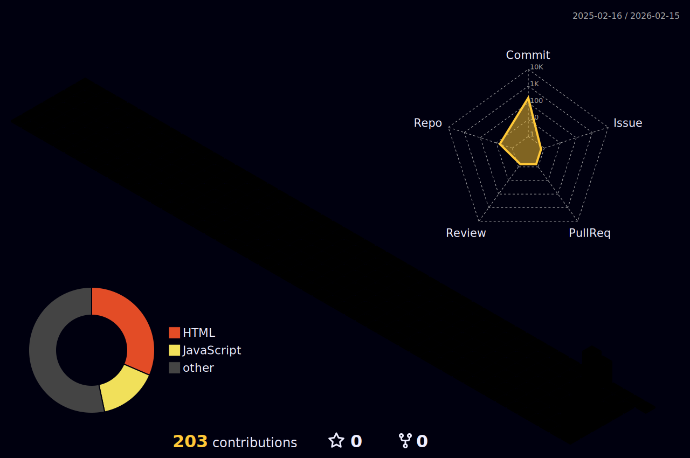

# Hi there, I'm Thành Đạt 👋

### 👨‍💻 About Me
- 🔭 I’m currently focused on **Python, C++, Java, Html5, C Development**.
- 🌱 Learning and improving my skills in **Backend** and **System Programming**.
- ⚡ Fun fact: I love building efficient and clean code.

---

### 🛠 Tech Stack

#### 🚀 Languages & Tools
     

#### 🧰 Tools & Platforms
    

---

### 📊 GitHub Stats

  
  

  

  

---

### 🚀 My Activity

  

---

### 🗓️ My 3D Contributions

  

---

### 📫 Get in touch
- **Email:** [thanhdat01404@gmail.com](mailto:thanhdat01404@gmail.com) 
